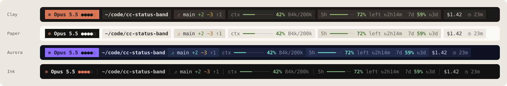
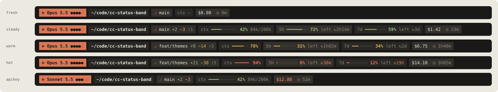
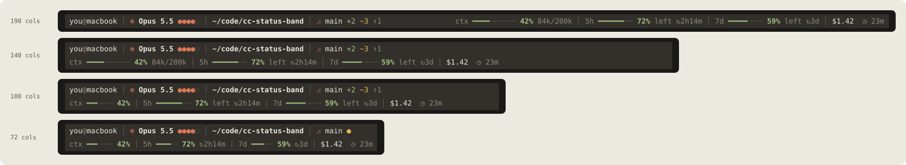

# Status Band

A designed status line for [Claude Code](https://code.claude.com). One quiet row under the prompt that shows the model and its effort, where you are, git, how full the context window is, how much of your 5-hour and weekly quota is **left**, and what the session has cost.

[中文说明](README.zh-CN.md)



It ships two ways from one codebase:

- **As a mod** (Claude Code 2.1.287 or later): drawn natively under the prompt with Claude Code's own UI elements, with a `/band` picker that previews every theme on your live session.
- **As a classic `statusLine` command** (any version with status lines): a dependency-free Node script that prints the same band with ANSI colors.

## What it shows

| Segment | Example | Notes |
| :- | :- | :- |
| Model · effort | `✻ Opus 5.5 ●●●●○` | Five pips for `low` … `max`; follows `/effort` live. Hidden for models without an effort setting. |
| Directory | `~/code/cc-status-band` | Abbreviates to `~/c/cc-status-band`, then the folder name, as space runs out. |
| Git | `⎇ main +2 ~3 ↑1` | Staged, unstaged/untracked, ahead/behind. Folds to `⎇ main ●` when narrow. |
| Context | `ctx ━━━━────── 42% 84k/200k` | Fills as the window fills: amber from 60%, red from 85%. |
| 5-hour quota left | `5h ━━━━━━── 72% left ↻2h14m` | Pro/Max subscribers. Drains as you spend: amber at 40% left, red under 15%. `↻` counts down to the refill. |
| Weekly quota left | `7d ━━━━╸─── 59% left ↻3d` | Its own chip and gauge, same colors. A gateway spend limit gets a third chip, `spend`. |
| Cost · time | `$1.42  ◷ 23m` | The session's running time by default, or the wall clock with `/band time clock`. `/band hide cost` drops the dollars and keeps the time. With API-key billing there are no quota windows, so spend is highlighted instead. |



The band measures its row and folds detail away until it fits, so it never wraps:



## Install the mod

Requires Claude Code **2.1.287+** (`claude --version`).

```text
/plugin marketplace add dukechain2333/cc-status-band
/plugin install status-band@cc-status-band
```

The band appears under the prompt in your next session (or after `/reload-plugins`).

If you also have a `statusLine` command in your settings you will see two bars. Remove `statusLine` from `~/.claude/settings.json`, or move the band above the prompt with `/band above`.

To try it without installing, clone the repo and start a session with it loaded:

```bash
git clone https://github.com/dukechain2333/cc-status-band
claude --plugin-dir ./cc-status-band
```

### Customize

Run `/band` to open the picker. A digit picks a theme, a letter picks a shape, glyph set or placement, and every row previews your current session:

```text
❯ 1: Clay      ✻ Opus 5.5 ●●●●○  ~/c/cc-status-band  ⎇ main ●  ctx ━━━━── 42%  5h 72% ↻2h14m
  2: Paper     …
  3: Aurora    …
  4: Ink       …

shape    d: theme default   c: chips   a: arrows   l: line
glyphs   u: unicode   n: nerd font   p: plain ascii
time     e: session time   k: clock 24h   h: clock 12h   o: off
place    b: below prompt   t: above prompt
```

Or set things directly. Each word sets whatever it names:

```text
/band aurora               theme: clay | paper | aurora | ink
/band line                 shape: auto | chips | arrows | line
/band nerd                 glyphs: unicode | nerd | ascii
/band above                place: below | above
/band time clock           time beside the cost: elapsed | clock (13:24) | clock12 (01:24PM) | off
/band gap 1                blank rows between the band and the footer line above it: 0 | 1 (default) | 2
/band hide cost git        hide: model dir git ctx 5h 7d spend cost (quota = all windows)
/band show cost
/band hint off             drop Claude Code's own hint line under the band
/band reset
/band help                 print the current setup
```

Choices are saved for every session on the machine.

## Use it as a classic statusLine

For Claude Code versions without mods, or if you prefer the classic row. Needs Node 18+.

```bash
git clone https://github.com/dukechain2333/cc-status-band ~/.claude/cc-status-band
node ~/.claude/cc-status-band/scripts/install-statusline.mjs --theme clay
```

The installer backs up `settings.json` first, then sets:

```json
{
  "statusLine": {
    "type": "command",
    "command": "node ~/.claude/cc-status-band/statusline/status-band.mjs --theme clay"
  }
}
```

Flags (or environment variables):

| Flag | Env | Values |
| :- | :- | :- |
| `--theme` | `STATUS_BAND_THEME` | `clay` (default), `paper`, `aurora`, `ink` |
| `--shape` | `STATUS_BAND_SHAPE` | `auto` (the theme's own), `chips`, `arrows`, `line` |
| `--glyphs` | `STATUS_BAND_GLYPHS` | `unicode` (default), `nerd`, `ascii` |
| `--time` | `STATUS_BAND_TIME` | `elapsed` (default), `clock`, `clock12`, `off` |
| `--hide` | `STATUS_BAND_HIDE` | comma list: `model,dir,git,ctx,5h,7d,spend,quota,cost` |
| `--colors` | `STATUS_BAND_COLORS` | `truecolor` or `256` (detected from `COLORTERM`/`TERM_PROGRAM` by default) |

Undo with `node scripts/install-statusline.mjs --uninstall`.

## Themes, shapes and glyphs

| Theme | For | Default shape |
| :- | :- | :- |
| **Clay** | warm dark terminals | chips |
| **Paper** | light terminals | chips |
| **Aurora** | cool, vivid dark terminals | arrows |
| **Ink** | anything; colored text, no fills | line |

Any shape works with any filled theme. **Chips** and **arrows** draw rounded and pointed caps with [Nerd Font](https://www.nerdfonts.com) glyphs when you pick the `nerd` glyph set; with the default `unicode` set they have square ends, which every font can draw. `ascii` avoids everything outside ASCII.

Preview them in your own terminal and font:

```bash
node scripts/preview.mjs                    # every theme
node scripts/preview.mjs --states           # every state in one theme
node scripts/preview.mjs --glyphs nerd
```

## How it works

```text
core/        pure ES modules shared by both front ends
  themes.js    palettes, shapes, glyph sets
  snapshot.js  statusLine JSON or mod session figures → one snapshot shape
  band.js      snapshot → segments → fold to width → colored runs
  ansi.js      runs → ANSI (truecolor or 256)
  elements.js  runs → mod Text elements
hooks/register.js        the mod: gathers figures via the mods API, draws, runs /band
statusline/status-band.mjs  the classic statusLine command
```

The mod reads the model, working directory and usage (`context`, `rateLimits`, `cost`) from `$.session`, takes the live effort from each `turn.step`, runs `git status --porcelain=v2` through `$.process.run` after each turn and every 20 seconds, and redraws on `session.measure`. It draws in the `PromptHint` render site (the line under the prompt) and keeps Claude Code's own hint line beneath it, or in the `AbovePrompt` band if you choose `above`.

## Develop

```bash
npm test                 # core unit tests (node --test) and mod tests (claude plugin test)
npm run validate         # claude plugin validate for the plugin and the marketplace
npm run preview          # see every theme in your terminal
npm run docs             # regenerate docs/*.svg from the real renderer
claude --plugin-dir .    # load your checkout; edits hot-reload
```

Tested with Claude Code 2.1.288. The mods API can change between releases; if something stops drawing, run `claude plugin validate .claude-plugin/plugin.json` and check the debug log.

## Design

The band was designed on a [Claude Design](https://claude.ai) canvas (overview, anatomy, themes, states, responsive widths and the picker) before it was built. [docs/DESIGN.md](docs/DESIGN.md) records the decisions: palettes, thresholds, folding order.

## License

MIT
